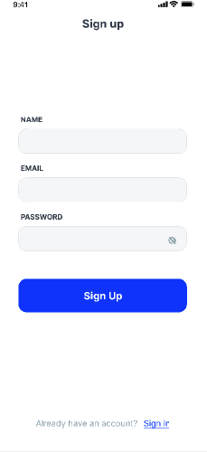

<h1 align="center">
    WIP: Taxi- app
</h1>

## :rocket: Sobre
    Aplicativo com funcionalidades similiar ao uber/99 taxi

## :rocket: Built at moment
<div align="center>

SignIn
<br>

Chat
<br>
</div>

## :information_source: How To Use [ BACK-END ]

To clone and run this application, you'll need [Git](https://git-scm.com), [Node.js v10.16][nodejs] or higher + [Yarn v1.13][yarn] or higher installed on your computer. From your command line:

```bash
# Clone this repository
$ git clone https://github.com/Jean1dev/react-native-taxi-app.git

# Go into the repository
$ cd react-native-taxi-app/backend

# Install dependencies
$ npm install

# Run the app 
$ npm start
```

## :information_source: How To Use [ MOBILE ]

To clone and run this application, you'll need [Git](https://git-scm.com), [Node.js v10.16][nodejs] or higher + [Yarn v1.13][yarn] or higher installed on your computer. From your command line:

```bash
# Clone this repository
$ git clone https://github.com/Jean1dev/react-native-taxi-app.git

# Go into the repository
$ cd react-native-taxi-app/mobile

# Install dependencies
$ npm install

#Config environment
create the .env file following the example of the env.example file
place your google maps key api

# Run the app 
$ npm start